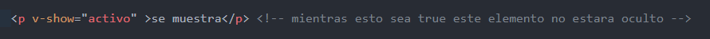

# Vue 💻
## Indice 
- [Vue 💻](#vue-)
  - [Indice](#indice)
  - [Instalacion ⬆](#instalacion-)
  - [Estructura de archivos ⬆](#estructura-de-archivos-)
  - [Single File Components ⬆](#single-file-components-)
  - [Sintaxis de plantilla ⬆](#sintaxis-de-plantilla-)
  - [Interpolacion de texto ⬆](#interpolacion-de-texto-)
  - [v-bind (Interpolacion de texto en atributos) ⬆](#v-bind-interpolacion-de-texto-en-atributos-)
  - [Expresiones de Javascript con interpolacion de texto ⬆](#expresiones-de-javascript-con-interpolacion-de-texto-)
  - [Directivas ⬆](#directivas-)
    - [v-if, v-else-if y v-else ⬆](#v-if-v-else-if-y-v-else-)
    - [v-show ⬆](#v-show-)
    - [v-for ⬆](#v-for-)
      - [Para arreglos ⬆](#para-arreglos-)
      - [Para objetos ⬆](#para-objetos-)
    - [v-for junto a v-if ⬆](#v-for-junto-a-v-if-)
    - [v-on y modificadores de eventos ⬆](#v-on-y-modificadores-de-eventos-)
    - [Reactividad ⬆](#reactividad-)
      - [ref() ⬆](#ref-)
        - [Pasos para usar ref() ⬆](#pasos-para-usar-ref-)
    - [Propiedades Computadas ⬆](#propiedades-computadas-)
        - [Pasos para usar las propiedades computadas ⬆](#pasos-para-usar-las-propiedades-computadas-)

## Instalacion [⬆](#indice)
  Para trabajar con vue, es necesario tener instalado node.js y npm (node package manager). Luego se puede proceder a instalar la version de Vue con la cual vas a trabajar.

  * Con ```npm``` : 
    ```
      npm create vue@latest
    ```
    
  * con ```CDN``` : 
    ```javascript 
      <script src="https://unpkg.com/vue@3/dist/vue.global.js"></script>
    ```
  
## Estructura de archivos [⬆](#indice)
  La estructura básica de un proyecto en VueJs es la siguiente:

  

  > **Nota** 
  > Nos damos cuenta que la estructura de archivos de VueJS es parecida a la estructura de archivos de otros frameworks como React o Astro.

## Single File Components [⬆](#indice)
  Es una tecnica que nos permite separar la logica, la estructura y los estilos.
  

## Sintaxis de plantilla [⬆](#indice)
  Vue utiliza una sintaxis de plantilla basada en HTML que le permite vincular declarativamente el DOM.
  

## Interpolacion de texto [⬆](#indice)
  La interpolacion de texto (bigote o llaves dobles) se utiliza para mostrar valores en el DOM.
  

## v-bind (Interpolacion de texto en atributos) [⬆](#indice)
  El atributo `v-bind` se utiliza para asignar valores a atributos.
  

## Expresiones de Javascript con interpolacion de texto [⬆](#indice)  
  Solo se puedn agregar ciertas expresiones de javascript utilizando la interpolacion de texto.
  

## Directivas [⬆](#indice)
  Son atributos especiales con prefijo `v-` que permiten aplicar comportamientos reactivos a nuestro DOM.
  ### v-if, v-else-if y v-else [⬆](#indice)
  Se encarga de renderizar u ocultar elementos dependiendo de si cumple o no una condicion.

  

  > **Nota** 
  > v-if, v-else-if y v-else son directivas que funcionan con la mimsa estructura que un if y un else en cualquier lenguaje de programacion.

  ### v-show [⬆](#indice)
  En este caso, el elemento sigue siendo parte del DOM pero solo se muestra o no segun las condiciones.
  

  ### v-for [⬆](#indice)
  Permite iterar sobre arreglos o propiedades de objetos.
  #### Para arreglos [⬆](#indice)
  Si tenemos el siguiente arreglo:

  

  Y queremos imprimir todos sus nombres, podemos hacerlo de esta manera:

  

  #### Para objetos [⬆](#indice)
  Si tenemos el siguiente objeto:
  
  

  Podemos acceder a las propiedades de un objeto de la siguiente forma:

  

  ### v-for junto a v-if [⬆](#indice)
  Si tenemos el siguiente arreglo de objetos: 

  

  Queremos imprimir los nombres de los usuarios que tengan menos de 30 años.

  

  ### v-on y modificadores de eventos [⬆](#indice)
  Es una directiva que nos permite escuchar eventos nativos del DOM como click, keypress, etc.

  `v-on:click="handler"` o `@click="handler"`

  Primero creamos una funcion que sera llamada por el evento click.

  

  luego llamamos la funcion para ser usada con el evento click y con los modificadores de eventos que nos permiten hacer click solo con un boton respectivo del mouse.

  

  ### Reactividad [⬆](#indice)
  #### ref() [⬆](#indice)
  * es una de las formas de trabajar con la reactividad de Vue 3.
  * es una referencia reactiva que nos permite actualizar autoaticamente el DOM cuando muta el estado reactivo.
  * al utilizar ``ref()`` en un valor reactivo ,vue nos devuelve un objeto y para acceder a su valor real(valor inicial de la variable reactiva) tenemos que utiliza `.value` para realizar la mutacion(modificacion del valor inicial).
  ##### Pasos para usar ref() [⬆](#indice) 
  * importamos el metodo de la libreria de vue
    ```javascript 
    import {ref} from 'vue';
    ```
  * creamos la funcion, que sera llamada cuando suceda un evento, que contiene el valor inicial de la variable reactiva(en nuestro caso es 0).

  ### Propiedades Computadas [⬆](#indice)
  Son funciones que calculan valores basados en otras propiedades. Nos sirven para generar calculos en nuestros componentes.
  El `computed()` siempre recibe una funcion flecha qu nos retorna algo
  ##### Pasos para usar las propiedades computadas [⬆](#indice)
  * importamos el metodo de la libreria de vue
    ```javascript 
    import {computed} from 'vue';
    ```
  * escribimos la funcion que nos devolvera ciertos valores segun la condicion(en este caso ciertas clases).
  
  

  * luego llamamos a la variable computada desde una clase en el elemento **Html**.
  
  

  > **Nota** 
  > En lugar de una propiedad computada podemos definir la misma funcion como un metodo ya que los dos enfoques dan el mismo resultado, sin embargo la diferencia es que las propiedades computadas se almacenan en cache en funcion se sus dependencias reactivas(una propiedad computada solo se volvera a evaluar cuando alguna de sus dependencias reactivas hayan cambiado)


